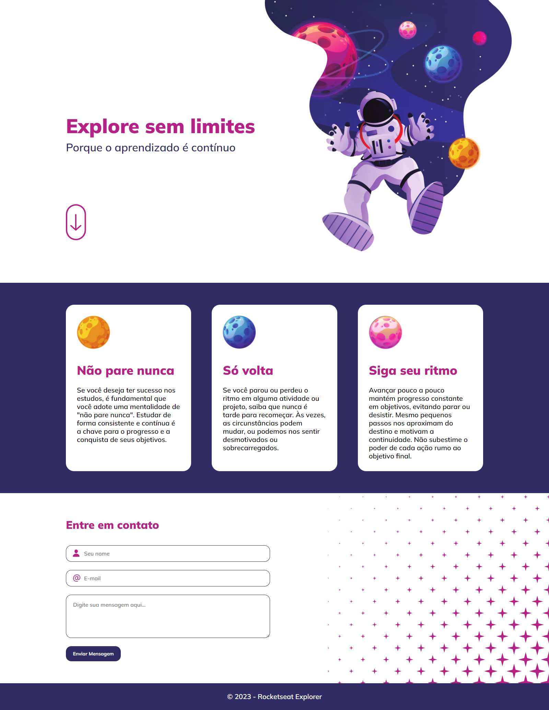

# Intensivo - Challenge

## ⚔️ **Desafio - Explore sem limites**

#### Desafio proposto para reforçar a prática das técnicas e conceitos abordados nos níveis iniciais do programa de formação Explorer.

 

 

## 📝 **Conceitos trabalhados**

**HTML e CSS**

- Estruturando um projeto HTML;
- Tags HTML mais comuns;
- Tags semânticas;
- Posicionamento e alinhamento dos elementos;
- Animações, transições e transformações;
- CSS Flexbox;
- Mobile First;

#### 👉🏽 Clique **[aqui](https://eduardofariasdev.github.io/intensive-challenge/)** e abra esse projeto no seu seu navegador.

 

🚀 **Projeto desenvolvido no programa de formação Explorer da Rocketseat.**
